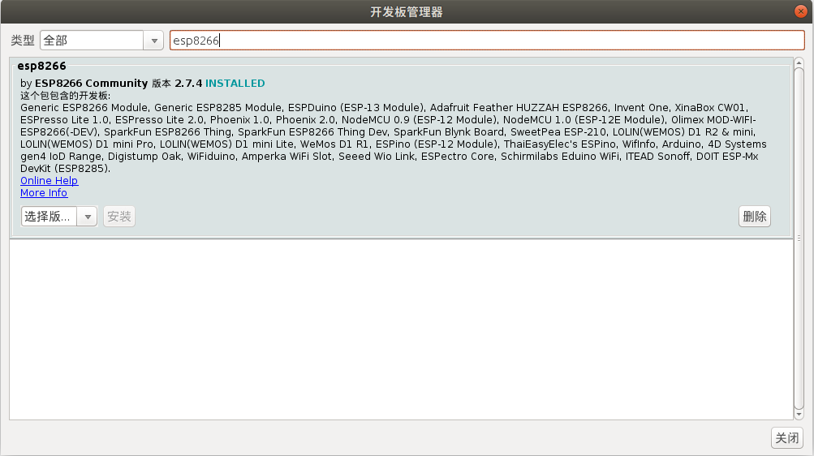
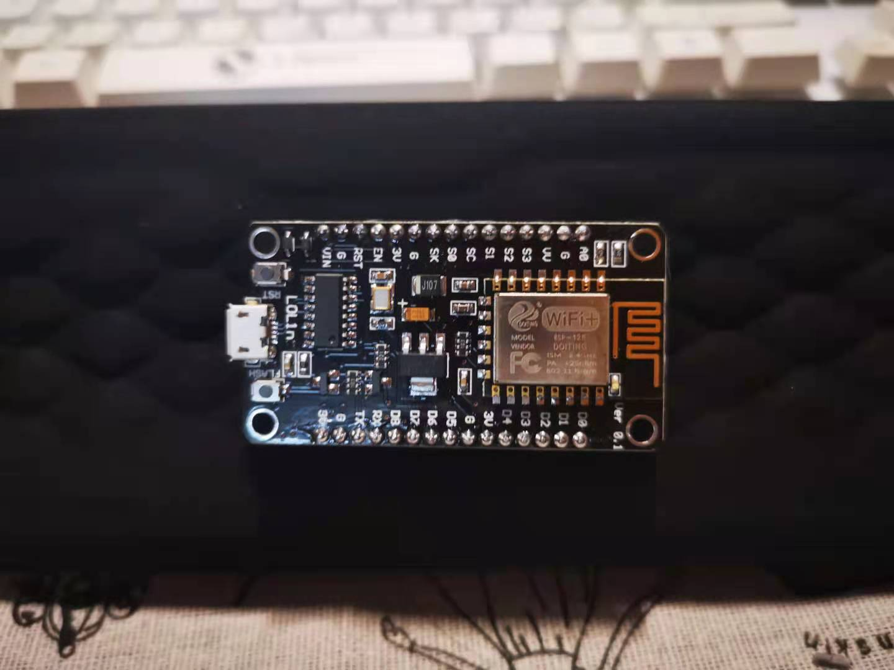
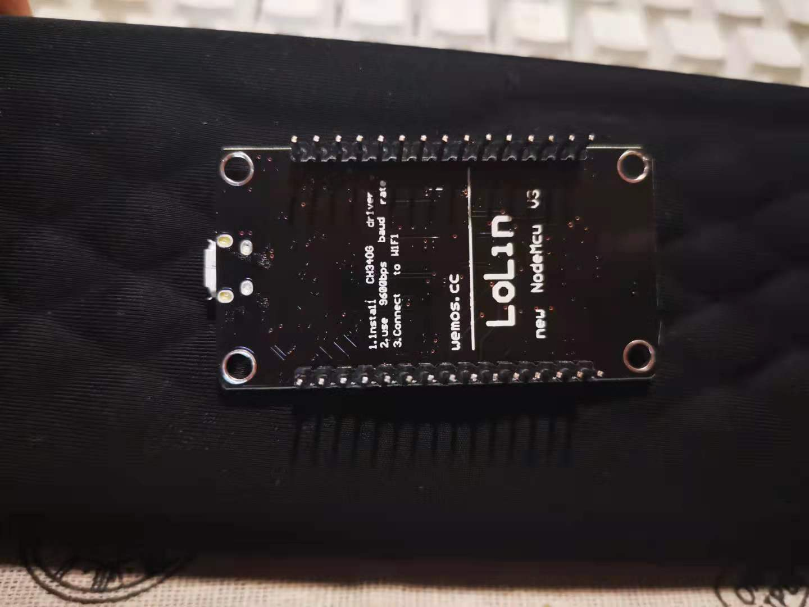
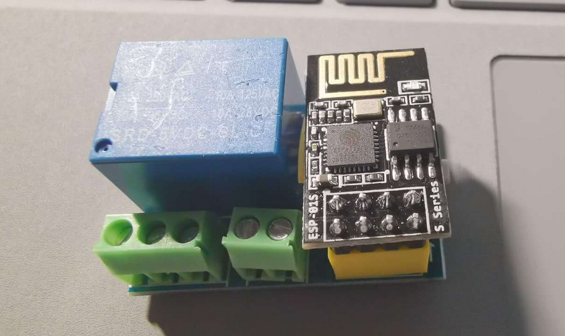
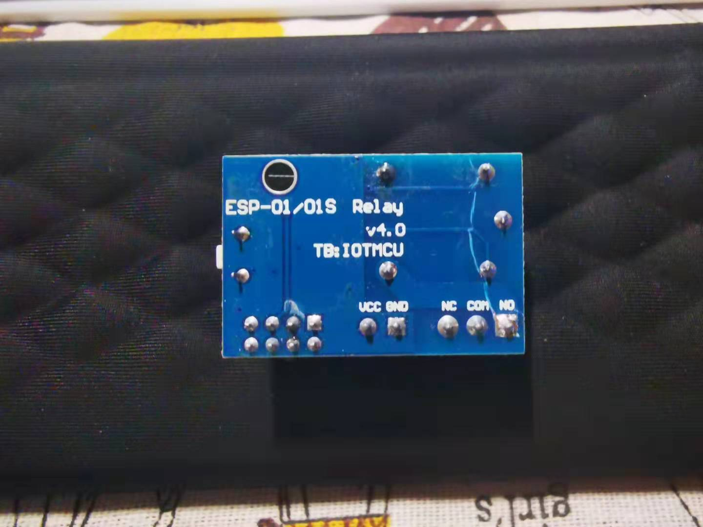

# ESP8266-MIOT

## 工程配置
1. 安装Arduino IDE 1.8.12
2. 做好科学上网的条件
3. 打开文件>首选项，更改附加开发板管理网址如下：http://arduino.esp8266.com/stable/package_esp8266com_index.json

4. 工具>开发板>开发板管理工具，搜索ESP8266，安装最新版

## Electric-Cooker
- 电饭煲控制代码

  

  

## Delay
- 继电器板控制代码

